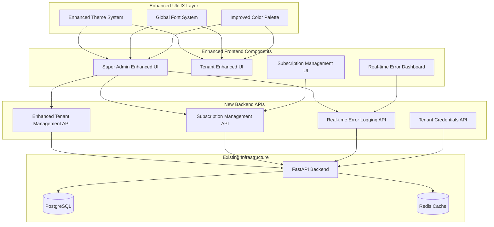
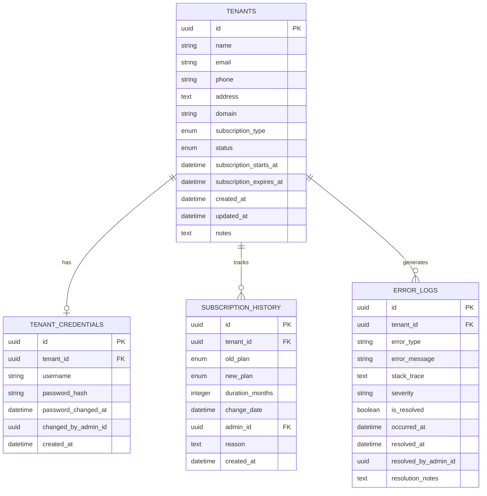

# Design Document

## Overview

This design document outlines the comprehensive UI/UX enhancements and tenant management improvements for the HesaabPlus multi-tenant SaaS platform. The design focuses on improving global font visibility, enhancing tenant management with full CRUD operations, implementing professional subscription management, upgrading real-time error logging, and creating a cohesive design system across both Super Admin and Tenant applications.

The enhancements will be built on top of the existing Docker-containerized architecture using FastAPI backend, React/TypeScript frontends, PostgreSQL database, and Redis caching, ensuring seamless integration with the current system.

## Architecture

### System Architecture Overview



### Enhanced Multi-Tenant Data Model


## Compone
nts and Interfaces

### Enhanced Theme System

#### Global Font and Color Configuration

```typescript
// shared/theme/typography.ts - Enhanced typography system
export const typography = {
  fontFamily: {
    primary: ['Vazirmatn', 'Tahoma', 'Arial', 'sans-serif'],
    secondary: ['Inter', 'system-ui', 'sans-serif'],
  },
  fontSize: {
    xs: '0.75rem',    // 12px
    sm: '0.875rem',   // 14px
    base: '1rem',     // 16px
    lg: '1.125rem',   // 18px
    xl: '1.25rem',    // 20px
    '2xl': '1.5rem',  // 24px
    '3xl': '1.875rem', // 30px
  },
  fontWeight: {
    light: '300',
    normal: '400',
    medium: '500',
    semibold: '600',
    bold: '700',
  },
  lineHeight: {
    tight: '1.25',
    normal: '1.5',
    relaxed: '1.75',
  }
};

// Enhanced color palette with accessibility focus
export const colors = {
  // High contrast text colors
  text: {
    primary: '#1a202c',      // Very dark gray for primary text
    secondary: '#2d3748',    // Dark gray for secondary text
    muted: '#4a5568',        // Medium gray for muted text
    inverse: '#ffffff',      // White text for dark backgrounds
    accent: '#2b6cb0',       // Blue for links and accents
  },
  
  // Background colors with proper contrast
  background: {
    primary: '#ffffff',      // Pure white
    secondary: '#f7fafc',    // Very light gray
    tertiary: '#edf2f7',     // Light gray
    dark: '#1a202c',         // Dark background
    gradient: {
      superAdmin: 'linear-gradient(135deg, #667eea 0%, #764ba2 100%)',
      tenant: 'linear-gradient(135deg, #f093fb 0%, #f5576c 100%)',
      success: 'linear-gradient(135deg, #4facfe 0%, #00f2fe 100%)',
    }
  },
  
  // Enhanced status colors
  status: {
    success: '#38a169',      // Green
    warning: '#d69e2e',      // Orange
    error: '#e53e3e',        // Red
    info: '#3182ce',         // Blue
    pending: '#805ad5',      // Purple
  },
  
  // Border and divider colors
  border: {
    light: '#e2e8f0',        // Light border
    medium: '#cbd5e0',       // Medium border
    dark: '#a0aec0',         // Dark border
  }
};
```

#### Enhanced Component Styling

```typescript
// shared/components/ui/enhanced-card.tsx
import React from 'react';
import { cn } from '@/lib/utils';
import { cva, type VariantProps } from 'class-variance-authority';

const enhancedCardVariants = cva(
  "rounded-xl transition-all duration-300 border-0 shadow-lg hover:shadow-xl",
  {
    variants: {
      variant: {
        // Professional cards with high contrast
        professional: 'bg-white text-gray-900',
        
        // Gradient background cards
        'gradient-super-admin': 'bg-gradient-to-br from-indigo-50 to-purple-100/50 text-gray-900',
        'gradient-tenant': 'bg-gradient-to-br from-green-50 to-teal-100/50 text-gray-900',
        
        // Status-based cards
        success: 'bg-gradient-to-br from-green-50 to-emerald-100/50 text-gray-900',
        warning: 'bg-gradient-to-br from-yellow-50 to-orange-100/50 text-gray-900',
        error: 'bg-gradient-to-br from-red-50 to-pink-100/50 text-gray-900',
        
        // Filter/header cards with enhanced visibility
        filter: 'bg-gradient-to-r from-slate-50 to-slate-100/80 text-gray-900 border border-slate-200',
      },
    },
    defaultVariants: {
      variant: 'professional',
    },
  }
);

// Enhanced table styling for better visibility
export const tableStyles = {
  container: 'rounded-lg border border-slate-200 bg-white shadow-sm overflow-hidden',
  header: 'bg-gradient-to-r from-slate-50 to-slate-100 border-b border-slate-200',
  headerCell: 'px-6 py-4 text-right text-sm font-semibold text-gray-900 tracking-wider',
  row: 'border-b border-slate-100 hover:bg-slate-50/50 transition-colors',
  cell: 'px-6 py-4 text-sm text-gray-900 font-medium',
  // Special styling for tenant name cells
  tenantNameCell: 'px-6 py-4 text-sm font-semibold text-indigo-700 bg-indigo-50/30',
};
```

### Enhanced Tenant Management System

#### Backend API Enhancements

```python
# backend/app/api/enhanced_tenant_management.py
from typing import Optional
from fastapi import APIRouter, Depends, HTTPException, status
from sqlalchemy.orm import Session
from datetime import datetime, timezone
import bcrypt

from ..core.database import get_db
from ..core.auth import get_super_admin_user
from ..models.tenant import Tenant
from ..models.user import User
from ..schemas.enhanced_tenant import (
    TenantCredentialsUpdateRequest,
    TenantFullUpdateRequest,
    TenantCredentialsResponse
)

router = APIRouter(prefix="/enhanced-tenant-management", tags=["Enhanced Tenant Management"])

@router.put("/tenants/{tenant_id}/credentials")
async def update_tenant_credentials(
    tenant_id: str,
    credentials_data: TenantCredentialsUpdateRequest,
    current_admin: User = Depends(get_super_admin_user),
    db: Session = Depends(get_db)
):
    """
    Update tenant owner credentials (username/email and password)
    """
    try:
        # Get tenant
        tenant = db.query(Tenant).filter(Tenant.id == tenant_id).first()
        if not tenant:
            raise HTTPException(status_code=404, detail="Tenant not found")
        
        # Get tenant owner (first user of the tenant)
        tenant_owner = db.query(User).filter(
            User.tenant_id == tenant_id,
            User.role == "owner"
        ).first()
        
        if not tenant_owner:
            raise HTTPException(status_code=404, detail="Tenant owner not found")
        
        # Update email if provided
        if credentials_data.email:
            # Check email uniqueness across all tenants
            existing_user = db.query(User).filter(
                User.email == credentials_data.email,
                User.id != tenant_owner.id
            ).first()
            
            if existing_user:
                raise HTTPException(
                    status_code=400, 
                    detail="Email already exists for another user"
                )
            
            tenant_owner.email = credentials_data.email
            tenant.email = credentials_data.email  # Update tenant email too
        
        # Update password if provided
        if credentials_data.password:
            # Hash the new password
            salt = bcrypt.gensalt()
            hashed_password = bcrypt.hashpw(credentials_data.password.encode('utf-8'), salt)
            tenant_owner.password_hash = hashed_password.decode('utf-8')
            tenant_owner.password_changed_at = datetime.now(timezone.utc)
        
        # Log the credential change
        change_note = f"\nCredentials updated by admin {current_admin.id} at {datetime.now(timezone.utc)}"
        if credentials_data.email:
            change_note += f" - Email changed to {credentials_data.email}"
        if credentials_data.password:
            change_note += " - Password updated"
        
        tenant.notes = (tenant.notes or "") + change_note
        tenant.updated_at = datetime.now(timezone.utc)
        
        db.commit()
        
        return {
            "success": True,
            "message": "Tenant credentials updated successfully",
            "tenant_id": tenant_id,
            "updated_email": tenant_owner.email if credentials_data.email else None
        }
        
    except HTTPException:
        raise
    except Exception as e:
        db.rollback()
        raise HTTPException(
            status_code=500,
            detail=f"Failed to update tenant credentials: {str(e)}"
        )

@router.put("/tenants/{tenant_id}/full-update")
async def full_tenant_update(
    tenant_id: str,
    update_data: TenantFullUpdateRequest,
    current_admin: User = Depends(get_super_admin_user),
    db: Session = Depends(get_db)
):
    """
    Comprehensive tenant update including profile and subscription
    """
    try:
        tenant = db.query(Tenant).filter(Tenant.id == tenant_id).first()
        if not tenant:
            raise HTTPException(status_code=404, detail="Tenant not found")
        
        # Track changes for audit log
        changes = []
        
        # Update basic information
        if update_data.name and update_data.name != tenant.name:
            changes.append(f"Name: {tenant.name} → {update_data.name}")
            tenant.name = update_data.name
        
        if update_data.phone and update_data.phone != tenant.phone:
            changes.append(f"Phone: {tenant.phone} → {update_data.phone}")
            tenant.phone = update_data.phone
        
        if update_data.address and update_data.address != tenant.address:
            changes.append(f"Address updated")
            tenant.address = update_data.address
        
        # Update subscription if provided
        if update_data.subscription_type and update_data.subscription_type != tenant.subscription_type:
            old_subscription = tenant.subscription_type
            changes.append(f"Subscription: {old_subscription} → {update_data.subscription_type}")
            
            tenant.subscription_type = update_data.subscription_type
            
            # Adjust limits based on new subscription
            if update_data.subscription_type == "pro":
                tenant.max_users = 5
                tenant.max_products = -1  # Unlimited
                tenant.max_customers = -1
                tenant.max_monthly_invoices = -1
                
                # Set subscription dates if upgrading to Pro
                if update_data.subscription_duration_months:
                    tenant.subscription_starts_at = datetime.now(timezone.utc)
                    tenant.subscription_expires_at = datetime.now(timezone.utc) + timedelta(
                        days=30 * update_data.subscription_duration_months
                    )
            else:  # Free plan
                tenant.max_users = 1
                tenant.max_products = 10
                tenant.max_customers = 10
                tenant.max_monthly_invoices = 10
                tenant.subscription_expires_at = None
        
        # Add audit log
        if changes:
            audit_note = f"\nFull update by admin {current_admin.id} at {datetime.now(timezone.utc)}:\n"
            audit_note += "\n".join(f"- {change}" for change in changes)
            tenant.notes = (tenant.notes or "") + audit_note
        
        tenant.updated_at = datetime.now(timezone.utc)
        db.commit()
        
        return {
            "success": True,
            "message": "Tenant updated successfully",
            "changes_made": len(changes),
            "changes": changes
        }
        
    except HTTPException:
        raise
    except Exception as e:
        db.rollback()
        raise HTTPException(
            status_code=500,
            detail=f"Failed to update tenant: {str(e)}"
        )
```

### Professional Subscription Management System

#### Subscription Management API

```python
# backend/app/api/subscription_management.py
from typing import List, Optional
from fastapi import APIRouter, Depends, HTTPException, Query
from sqlalchemy.orm import Session
from datetime import datetime, timezone, timedelta

from ..core.database import get_db
from ..core.auth import get_super_admin_user
from ..models.tenant import Tenant, SubscriptionType
from ..schemas.subscription import (
    SubscriptionExtensionRequest,
    SubscriptionStatusUpdateRequest,
    SubscriptionHistoryResponse,
    SubscriptionStatsResponse
)

router = APIRouter(prefix="/subscription-management", tags=["Subscription Management"])

@router.get("/subscriptions/overview")
async def get_subscription_overview(
    current_admin: User = Depends(get_super_admin_user),
    db: Session = Depends(get_db)
):
    """
    Get comprehensive subscription overview and statistics
    """
    try:
        # Get subscription counts
        total_tenants = db.query(Tenant).count()
        free_tenants = db.query(Tenant).filter(Tenant.subscription_type == SubscriptionType.FREE).count()
        pro_tenants = db.query(Tenant).filter(Tenant.subscription_type == SubscriptionType.PRO).count()
        
        # Get expiring subscriptions (next 30 days)
        thirty_days_from_now = datetime.now(timezone.utc) + timedelta(days=30)
        expiring_soon = db.query(Tenant).filter(
            Tenant.subscription_type == SubscriptionType.PRO,
            Tenant.subscription_expires_at <= thirty_days_from_now,
            Tenant.subscription_expires_at > datetime.now(timezone.utc)
        ).count()
        
        # Get expired subscriptions
        expired = db.query(Tenant).filter(
            Tenant.subscription_type == SubscriptionType.PRO,
            Tenant.subscription_expires_at < datetime.now(timezone.utc)
        ).count()
        
        return SubscriptionStatsResponse(
            total_tenants=total_tenants,
            free_subscriptions=free_tenants,
            pro_subscriptions=pro_tenants,
            expiring_soon=expiring_soon,
            expired=expired,
            conversion_rate=(pro_tenants / total_tenants * 100) if total_tenants > 0 else 0
        )
        
    except Exception as e:
        raise HTTPException(
            status_code=500,
            detail=f"Failed to get subscription overview: {str(e)}"
        )

@router.post("/subscriptions/{tenant_id}/extend")
async def extend_subscription(
    tenant_id: str,
    extension_data: SubscriptionExtensionRequest,
    current_admin: User = Depends(get_super_admin_user),
    db: Session = Depends(get_db)
):
    """
    Extend tenant subscription by specified number of months
    """
    try:
        tenant = db.query(Tenant).filter(Tenant.id == tenant_id).first()
        if not tenant:
            raise HTTPException(status_code=404, detail="Tenant not found")
        
        # Calculate new expiration date
        if tenant.subscription_expires_at and tenant.subscription_expires_at > datetime.now(timezone.utc):
            # Extend from current expiration date
            new_expiration = tenant.subscription_expires_at + timedelta(days=30 * extension_data.months)
        else:
            # Start from now if expired or no expiration set
            new_expiration = datetime.now(timezone.utc) + timedelta(days=30 * extension_data.months)
        
        # Update subscription
        old_expiration = tenant.subscription_expires_at
        tenant.subscription_expires_at = new_expiration
        
        # Ensure tenant is Pro if extending
        if tenant.subscription_type != SubscriptionType.PRO:
            tenant.subscription_type = SubscriptionType.PRO
            tenant.upgrade_to_pro_limits()
        
        # Log the extension
        extension_note = f"\nSubscription extended by {extension_data.months} months by admin {current_admin.id}"
        extension_note += f"\nOld expiration: {old_expiration}"
        extension_note += f"\nNew expiration: {new_expiration}"
        if extension_data.reason:
            extension_note += f"\nReason: {extension_data.reason}"
        extension_note += f"\nDate: {datetime.now(timezone.utc)}"
        
        tenant.notes = (tenant.notes or "") + extension_note
        tenant.updated_at = datetime.now(timezone.utc)
        
        db.commit()
        
        return {
            "success": True,
            "message": f"Subscription extended by {extension_data.months} months",
            "tenant_id": tenant_id,
            "new_expiration_date": new_expiration,
            "days_added": 30 * extension_data.months
        }
        
    except HTTPException:
        raise
    except Exception as e:
        db.rollback()
        raise HTTPException(
            status_code=500,
            detail=f"Failed to extend subscription: {str(e)}"
        )

@router.put("/subscriptions/{tenant_id}/status")
async def update_subscription_status(
    tenant_id: str,
    status_data: SubscriptionStatusUpdateRequest,
    current_admin: User = Depends(get_super_admin_user),
    db: Session = Depends(get_db)
):
    """
    Activate or deactivate tenant subscription
    """
    try:
        tenant = db.query(Tenant).filter(Tenant.id == tenant_id).first()
        if not tenant:
            raise HTTPException(status_code=404, detail="Tenant not found")
        
        old_status = tenant.status
        old_subscription = tenant.subscription_type
        
        if status_data.activate:
            # Activate subscription
            tenant.status = "active"
            if status_data.subscription_type:
                tenant.subscription_type = status_data.subscription_type
                
                if status_data.subscription_type == SubscriptionType.PRO:
                    tenant.upgrade_to_pro_limits()
                    # Set expiration if not set
                    if not tenant.subscription_expires_at:
                        tenant.subscription_expires_at = datetime.now(timezone.utc) + timedelta(days=365)
                else:
                    tenant.downgrade_to_free_limits()
        else:
            # Deactivate subscription
            tenant.status = "suspended"
        
        # Log the status change
        status_note = f"\nSubscription status changed by admin {current_admin.id}"
        status_note += f"\nOld status: {old_status}, New status: {tenant.status}"
        status_note += f"\nOld subscription: {old_subscription}, New subscription: {tenant.subscription_type}"
        if status_data.reason:
            status_note += f"\nReason: {status_data.reason}"
        status_note += f"\nDate: {datetime.now(timezone.utc)}"
        
        tenant.notes = (tenant.notes or "") + status_note
        tenant.updated_at = datetime.now(timezone.utc)
        
        db.commit()
        
        return {
            "success": True,
            "message": "Subscription status updated successfully",
            "tenant_id": tenant_id,
            "new_status": tenant.status,
            "subscription_type": tenant.subscription_type
        }
        
    except HTTPException:
        raise
    except Exception as e:
        db.rollback()
        raise HTTPException(
            status_code=500,
            detail=f"Failed to update subscription status: {str(e)}"
        )
```### Re
al-Time Error Logging System

#### Enhanced Error Logging API

```python
# backend/app/api/enhanced_error_logging.py
from typing import List, Optional
from fastapi import APIRouter, Depends, HTTPException, Query, WebSocket
from sqlalchemy.orm import Session
from datetime import datetime, timezone
import json
import asyncio

from ..core.database import get_db
from ..core.auth import get_super_admin_user
from ..models.error_log import ErrorLog, ErrorSeverity, ErrorStatus
from ..schemas.error_logging import (
    ErrorLogResponse,
    ErrorLogCreateRequest,
    ErrorLogUpdateRequest,
    ErrorStatsResponse
)

router = APIRouter(prefix="/error-logging", tags=["Enhanced Error Logging"])

# WebSocket connection manager for real-time updates
class ErrorLogConnectionManager:
    def __init__(self):
        self.active_connections: List[WebSocket] = []
    
    async def connect(self, websocket: WebSocket):
        await websocket.accept()
        self.active_connections.append(websocket)
    
    def disconnect(self, websocket: WebSocket):
        self.active_connections.remove(websocket)
    
    async def broadcast_error(self, error_data: dict):
        for connection in self.active_connections:
            try:
                await connection.send_text(json.dumps(error_data))
            except:
                # Remove disconnected clients
                self.active_connections.remove(connection)

error_manager = ErrorLogConnectionManager()

@router.websocket("/ws/errors")
async def websocket_endpoint(websocket: WebSocket):
    """
    WebSocket endpoint for real-time error updates
    """
    await error_manager.connect(websocket)
    try:
        while True:
            await websocket.receive_text()
    except:
        error_manager.disconnect(websocket)

@router.get("/errors/active", response_model=List[ErrorLogResponse])
async def get_active_errors(
    tenant_id: Optional[str] = Query(None),
    severity: Optional[ErrorSeverity] = Query(None),
    error_type: Optional[str] = Query(None),
    limit: int = Query(50, le=100),
    current_admin: User = Depends(get_super_admin_user),
    db: Session = Depends(get_db)
):
    """
    Get only currently active (unresolved) errors
    """
    try:
        query = db.query(ErrorLog).filter(ErrorLog.status == ErrorStatus.ACTIVE)
        
        if tenant_id:
            query = query.filter(ErrorLog.tenant_id == tenant_id)
        
        if severity:
            query = query.filter(ErrorLog.severity == severity)
        
        if error_type:
            query = query.filter(ErrorLog.error_type.ilike(f"%{error_type}%"))
        
        errors = query.order_by(ErrorLog.occurred_at.desc()).limit(limit).all()
        
        return [
            ErrorLogResponse(
                id=str(error.id),
                tenant_id=str(error.tenant_id) if error.tenant_id else None,
                tenant_name=error.tenant.name if error.tenant else "System",
                error_type=error.error_type,
                error_message=error.error_message,
                severity=error.severity,
                status=error.status,
                occurred_at=error.occurred_at,
                stack_trace=error.stack_trace,
                context_data=error.context_data
            )
            for error in errors
        ]
        
    except Exception as e:
        raise HTTPException(
            status_code=500,
            detail=f"Failed to get active errors: {str(e)}"
        )

@router.get("/errors/stats", response_model=ErrorStatsResponse)
async def get_error_statistics(
    current_admin: User = Depends(get_super_admin_user),
    db: Session = Depends(get_db)
):
    """
    Get real-time error statistics
    """
    try:
        # Count active errors by severity
        critical_count = db.query(ErrorLog).filter(
            ErrorLog.status == ErrorStatus.ACTIVE,
            ErrorLog.severity == ErrorSeverity.CRITICAL
        ).count()
        
        high_count = db.query(ErrorLog).filter(
            ErrorLog.status == ErrorStatus.ACTIVE,
            ErrorLog.severity == ErrorSeverity.HIGH
        ).count()
        
        medium_count = db.query(ErrorLog).filter(
            ErrorLog.status == ErrorStatus.ACTIVE,
            ErrorLog.severity == ErrorSeverity.MEDIUM
        ).count()
        
        low_count = db.query(ErrorLog).filter(
            ErrorLog.status == ErrorStatus.ACTIVE,
            ErrorLog.severity == ErrorSeverity.LOW
        ).count()
        
        total_active = critical_count + high_count + medium_count + low_count
        
        # Get recent error trend (last 24 hours)
        twenty_four_hours_ago = datetime.now(timezone.utc) - timedelta(hours=24)
        recent_errors = db.query(ErrorLog).filter(
            ErrorLog.occurred_at >= twenty_four_hours_ago
        ).count()
        
        return ErrorStatsResponse(
            total_active_errors=total_active,
            critical_errors=critical_count,
            high_priority_errors=high_count,
            medium_priority_errors=medium_count,
            low_priority_errors=low_count,
            errors_last_24h=recent_errors,
            last_updated=datetime.now(timezone.utc)
        )
        
    except Exception as e:
        raise HTTPException(
            status_code=500,
            detail=f"Failed to get error statistics: {str(e)}"
        )

@router.put("/errors/{error_id}/resolve")
async def resolve_error(
    error_id: str,
    resolution_data: ErrorLogUpdateRequest,
    current_admin: User = Depends(get_super_admin_user),
    db: Session = Depends(get_db)
):
    """
    Mark error as resolved
    """
    try:
        error = db.query(ErrorLog).filter(ErrorLog.id == error_id).first()
        if not error:
            raise HTTPException(status_code=404, detail="Error not found")
        
        error.status = ErrorStatus.RESOLVED
        error.resolved_at = datetime.now(timezone.utc)
        error.resolved_by_admin_id = current_admin.id
        error.resolution_notes = resolution_data.resolution_notes
        
        db.commit()
        
        # Broadcast resolution to connected clients
        await error_manager.broadcast_error({
            "type": "error_resolved",
            "error_id": error_id,
            "resolved_by": current_admin.email,
            "resolved_at": error.resolved_at.isoformat()
        })
        
        return {
            "success": True,
            "message": "Error marked as resolved",
            "error_id": error_id
        }
        
    except HTTPException:
        raise
    except Exception as e:
        db.rollback()
        raise HTTPException(
            status_code=500,
            detail=f"Failed to resolve error: {str(e)}"
        )
```

### Enhanced Frontend Components

#### Super Admin Enhanced UI Components

```typescript
// super-admin-frontend/src/components/enhanced/TenantManagementEnhanced.tsx
import React, { useState } from 'react';
import { useQuery, useMutation, useQueryClient } from '@tanstack/react-query';
import { Card, CardContent, CardHeader, CardTitle } from '@/components/ui/enhanced-card';
import { Button } from '@/components/ui/button';
import { Input } from '@/components/ui/input';
import { Badge } from '@/components/ui/badge';
import { Dialog, DialogContent, DialogHeader, DialogTitle } from '@/components/ui/dialog';
import { Form, FormField, FormItem, FormLabel, FormControl } from '@/components/ui/form';
import { useForm } from 'react-hook-form';
import { toast } from '@/components/ui/use-toast';

interface TenantCredentialsForm {
  email: string;
  password: string;
  confirmPassword: string;
}

interface TenantFullUpdateForm {
  name: string;
  phone: string;
  address: string;
  subscription_type: 'free' | 'pro';
  subscription_duration_months?: number;
}

export const TenantManagementEnhanced: React.FC = () => {
  const [selectedTenant, setSelectedTenant] = useState<any>(null);
  const [showCredentialsDialog, setShowCredentialsDialog] = useState(false);
  const [showFullUpdateDialog, setShowFullUpdateDialog] = useState(false);
  
  const queryClient = useQueryClient();
  
  // Enhanced tenant list with better styling
  const { data: tenants, isLoading } = useQuery({
    queryKey: ['tenants'],
    queryFn: () => fetch('/api/super-admin/tenants').then(res => res.json())
  });
  
  // Credentials update mutation
  const credentialsUpdateMutation = useMutation({
    mutationFn: (data: { tenantId: string; credentials: TenantCredentialsForm }) =>
      fetch(`/api/enhanced-tenant-management/tenants/${data.tenantId}/credentials`, {
        method: 'PUT',
        headers: { 'Content-Type': 'application/json' },
        body: JSON.stringify(data.credentials)
      }).then(res => res.json()),
    onSuccess: () => {
      toast({ title: 'Success', description: 'Tenant credentials updated successfully' });
      setShowCredentialsDialog(false);
      queryClient.invalidateQueries({ queryKey: ['tenants'] });
    }
  });
  
  // Full update mutation
  const fullUpdateMutation = useMutation({
    mutationFn: (data: { tenantId: string; updates: TenantFullUpdateForm }) =>
      fetch(`/api/enhanced-tenant-management/tenants/${data.tenantId}/full-update`, {
        method: 'PUT',
        headers: { 'Content-Type': 'application/json' },
        body: JSON.stringify(data.updates)
      }).then(res => res.json()),
    onSuccess: () => {
      toast({ title: 'Success', description: 'Tenant updated successfully' });
      setShowFullUpdateDialog(false);
      queryClient.invalidateQueries({ queryKey: ['tenants'] });
    }
  });
  
  const credentialsForm = useForm<TenantCredentialsForm>();
  const fullUpdateForm = useForm<TenantFullUpdateForm>();
  
  const handleCredentialsUpdate = (data: TenantCredentialsForm) => {
    if (data.password !== data.confirmPassword) {
      toast({ title: 'Error', description: 'Passwords do not match', variant: 'destructive' });
      return;
    }
    
    credentialsUpdateMutation.mutate({
      tenantId: selectedTenant.id,
      credentials: data
    });
  };
  
  const handleFullUpdate = (data: TenantFullUpdateForm) => {
    fullUpdateMutation.mutate({
      tenantId: selectedTenant.id,
      updates: data
    });
  };
  
  if (isLoading) {
    return <div className="flex justify-center p-8">Loading tenants...</div>;
  }
  
  return (
    <div className="space-y-6">
      <Card variant="gradient-super-admin">
        <CardHeader>
          <CardTitle className="text-2xl font-bold text-gray-900">
            Enhanced Tenant Management
          </CardTitle>
        </CardHeader>
        <CardContent>
          <div className="overflow-hidden rounded-lg border border-slate-200 bg-white shadow-sm">
            <table className="w-full">
              <thead className="bg-gradient-to-r from-slate-50 to-slate-100 border-b border-slate-200">
                <tr>
                  <th className="px-6 py-4 text-right text-sm font-semibold text-gray-900">
                    Tenant Name
                  </th>
                  <th className="px-6 py-4 text-right text-sm font-semibold text-gray-900">
                    Email
                  </th>
                  <th className="px-6 py-4 text-right text-sm font-semibold text-gray-900">
                    Subscription
                  </th>
                  <th className="px-6 py-4 text-right text-sm font-semibold text-gray-900">
                    Status
                  </th>
                  <th className="px-6 py-4 text-right text-sm font-semibold text-gray-900">
                    Actions
                  </th>
                </tr>
              </thead>
              <tbody>
                {tenants?.tenants?.map((tenant: any) => (
                  <tr key={tenant.id} className="border-b border-slate-100 hover:bg-slate-50/50">
                    {/* Enhanced tenant name cell with high contrast */}
                    <td className="px-6 py-4 text-sm font-semibold text-indigo-700 bg-indigo-50/30">
                      {tenant.name}
                    </td>
                    <td className="px-6 py-4 text-sm text-gray-900 font-medium">
                      {tenant.email}
                    </td>
                    <td className="px-6 py-4">
                      <Badge variant={tenant.subscription_type === 'pro' ? 'success' : 'secondary'}>
                        {tenant.subscription_type.toUpperCase()}
                      </Badge>
                    </td>
                    <td className="px-6 py-4">
                      <Badge variant={tenant.status === 'active' ? 'success' : 'warning'}>
                        {tenant.status}
                      </Badge>
                    </td>
                    <td className="px-6 py-4 space-x-2">
                      <Button
                        size="sm"
                        variant="outline"
                        onClick={() => {
                          setSelectedTenant(tenant);
                          setShowCredentialsDialog(true);
                        }}
                      >
                        Update Credentials
                      </Button>
                      <Button
                        size="sm"
                        variant="gradient-blue"
                        onClick={() => {
                          setSelectedTenant(tenant);
                          fullUpdateForm.reset({
                            name: tenant.name,
                            phone: tenant.phone,
                            address: tenant.address,
                            subscription_type: tenant.subscription_type
                          });
                          setShowFullUpdateDialog(true);
                        }}
                      >
                        Full Edit
                      </Button>
                    </td>
                  </tr>
                ))}
              </tbody>
            </table>
          </div>
        </CardContent>
      </Card>
      
      {/* Credentials Update Dialog */}
      <Dialog open={showCredentialsDialog} onOpenChange={setShowCredentialsDialog}>
        <DialogContent>
          <DialogHeader>
            <DialogTitle>Update Tenant Credentials</DialogTitle>
          </DialogHeader>
          <Form {...credentialsForm}>
            <form onSubmit={credentialsForm.handleSubmit(handleCredentialsUpdate)} className="space-y-4">
              <FormField
                control={credentialsForm.control}
                name="email"
                render={({ field }) => (
                  <FormItem>
                    <FormLabel>Email</FormLabel>
                    <FormControl>
                      <Input {...field} type="email" placeholder="Enter new email" />
                    </FormControl>
                  </FormItem>
                )}
              />
              <FormField
                control={credentialsForm.control}
                name="password"
                render={({ field }) => (
                  <FormItem>
                    <FormLabel>New Password</FormLabel>
                    <FormControl>
                      <Input {...field} type="password" placeholder="Enter new password" />
                    </FormControl>
                  </FormItem>
                )}
              />
              <FormField
                control={credentialsForm.control}
                name="confirmPassword"
                render={({ field }) => (
                  <FormItem>
                    <FormLabel>Confirm Password</FormLabel>
                    <FormControl>
                      <Input {...field} type="password" placeholder="Confirm new password" />
                    </FormControl>
                  </FormItem>
                )}
              />
              <div className="flex justify-end space-x-2">
                <Button type="button" variant="outline" onClick={() => setShowCredentialsDialog(false)}>
                  Cancel
                </Button>
                <Button type="submit" variant="gradient-green" disabled={credentialsUpdateMutation.isPending}>
                  Update Credentials
                </Button>
              </div>
            </form>
          </Form>
        </DialogContent>
      </Dialog>
      
      {/* Full Update Dialog */}
      <Dialog open={showFullUpdateDialog} onOpenChange={setShowFullUpdateDialog}>
        <DialogContent className="max-w-2xl">
          <DialogHeader>
            <DialogTitle>Full Tenant Update</DialogTitle>
          </DialogHeader>
          <Form {...fullUpdateForm}>
            <form onSubmit={fullUpdateForm.handleSubmit(handleFullUpdate)} className="space-y-4">
              <div className="grid grid-cols-2 gap-4">
                <FormField
                  control={fullUpdateForm.control}
                  name="name"
                  render={({ field }) => (
                    <FormItem>
                      <FormLabel>Tenant Name</FormLabel>
                      <FormControl>
                        <Input {...field} placeholder="Enter tenant name" />
                      </FormControl>
                    </FormItem>
                  )}
                />
                <FormField
                  control={fullUpdateForm.control}
                  name="phone"
                  render={({ field }) => (
                    <FormItem>
                      <FormLabel>Phone</FormLabel>
                      <FormControl>
                        <Input {...field} placeholder="Enter phone number" />
                      </FormControl>
                    </FormItem>
                  )}
                />
              </div>
              <FormField
                control={fullUpdateForm.control}
                name="address"
                render={({ field }) => (
                  <FormItem>
                    <FormLabel>Address</FormLabel>
                    <FormControl>
                      <Input {...field} placeholder="Enter address" />
                    </FormControl>
                  </FormItem>
                )}
              />
              <div className="grid grid-cols-2 gap-4">
                <FormField
                  control={fullUpdateForm.control}
                  name="subscription_type"
                  render={({ field }) => (
                    <FormItem>
                      <FormLabel>Subscription Plan</FormLabel>
                      <FormControl>
                        <select {...field} className="w-full p-2 border rounded-md">
                          <option value="free">Free</option>
                          <option value="pro">Pro</option>
                        </select>
                      </FormControl>
                    </FormItem>
                  )}
                />
                <FormField
                  control={fullUpdateForm.control}
                  name="subscription_duration_months"
                  render={({ field }) => (
                    <FormItem>
                      <FormLabel>Duration (Months)</FormLabel>
                      <FormControl>
                        <Input {...field} type="number" min="1" max="24" placeholder="12" />
                      </FormControl>
                    </FormItem>
                  )}
                />
              </div>
              <div className="flex justify-end space-x-2">
                <Button type="button" variant="outline" onClick={() => setShowFullUpdateDialog(false)}>
                  Cancel
                </Button>
                <Button type="submit" variant="gradient-blue" disabled={fullUpdateMutation.isPending}>
                  Update Tenant
                </Button>
              </div>
            </form>
          </Form>
        </DialogContent>
      </Dialog>
    </div>
  );
};
```##
 Data Models

### Enhanced Database Schema

```sql
-- Enhanced tenant credentials tracking
CREATE TABLE tenant_credentials (
    id UUID PRIMARY KEY DEFAULT gen_random_uuid(),
    tenant_id UUID NOT NULL REFERENCES tenants(id) ON DELETE CASCADE,
    username VARCHAR(255) NOT NULL,
    password_hash VARCHAR(255) NOT NULL,
    password_changed_at TIMESTAMP DEFAULT CURRENT_TIMESTAMP,
    changed_by_admin_id UUID REFERENCES users(id),
    created_at TIMESTAMP DEFAULT CURRENT_TIMESTAMP,
    updated_at TIMESTAMP DEFAULT CURRENT_TIMESTAMP
);

-- Subscription history tracking
CREATE TABLE subscription_history (
    id UUID PRIMARY KEY DEFAULT gen_random_uuid(),
    tenant_id UUID NOT NULL REFERENCES tenants(id) ON DELETE CASCADE,
    old_plan VARCHAR(20),
    new_plan VARCHAR(20) NOT NULL,
    duration_months INTEGER,
    change_date TIMESTAMP DEFAULT CURRENT_TIMESTAMP,
    admin_id UUID NOT NULL REFERENCES users(id),
    reason TEXT,
    created_at TIMESTAMP DEFAULT CURRENT_TIMESTAMP
);

-- Enhanced error logging
CREATE TYPE error_severity AS ENUM ('low', 'medium', 'high', 'critical');
CREATE TYPE error_status AS ENUM ('active', 'resolved', 'ignored');

CREATE TABLE error_logs (
    id UUID PRIMARY KEY DEFAULT gen_random_uuid(),
    tenant_id UUID REFERENCES tenants(id),
    error_type VARCHAR(100) NOT NULL,
    error_message TEXT NOT NULL,
    stack_trace TEXT,
    severity error_severity NOT NULL DEFAULT 'medium',
    status error_status NOT NULL DEFAULT 'active',
    context_data JSONB,
    occurred_at TIMESTAMP DEFAULT CURRENT_TIMESTAMP,
    resolved_at TIMESTAMP,
    resolved_by_admin_id UUID REFERENCES users(id),
    resolution_notes TEXT,
    created_at TIMESTAMP DEFAULT CURRENT_TIMESTAMP
);

-- Indexes for performance
CREATE INDEX idx_error_logs_status ON error_logs(status);
CREATE INDEX idx_error_logs_severity ON error_logs(severity);
CREATE INDEX idx_error_logs_tenant_id ON error_logs(tenant_id);
CREATE INDEX idx_error_logs_occurred_at ON error_logs(occurred_at);
CREATE INDEX idx_subscription_history_tenant_id ON subscription_history(tenant_id);
CREATE INDEX idx_tenant_credentials_tenant_id ON tenant_credentials(tenant_id);
```

### Enhanced Pydantic Schemas

```python
# backend/app/schemas/enhanced_tenant.py
from typing import Optional, List
from pydantic import BaseModel, EmailStr
from datetime import datetime
from enum import Enum

class SubscriptionType(str, Enum):
    FREE = "free"
    PRO = "pro"

class TenantCredentialsUpdateRequest(BaseModel):
    email: Optional[EmailStr] = None
    password: Optional[str] = None

class TenantFullUpdateRequest(BaseModel):
    name: Optional[str] = None
    phone: Optional[str] = None
    address: Optional[str] = None
    subscription_type: Optional[SubscriptionType] = None
    subscription_duration_months: Optional[int] = None

class SubscriptionExtensionRequest(BaseModel):
    months: int
    reason: Optional[str] = None

class SubscriptionStatusUpdateRequest(BaseModel):
    activate: bool
    subscription_type: Optional[SubscriptionType] = None
    reason: Optional[str] = None

class ErrorSeverity(str, Enum):
    LOW = "low"
    MEDIUM = "medium"
    HIGH = "high"
    CRITICAL = "critical"

class ErrorStatus(str, Enum):
    ACTIVE = "active"
    RESOLVED = "resolved"
    IGNORED = "ignored"

class ErrorLogCreateRequest(BaseModel):
    tenant_id: Optional[str] = None
    error_type: str
    error_message: str
    stack_trace: Optional[str] = None
    severity: ErrorSeverity = ErrorSeverity.MEDIUM
    context_data: Optional[dict] = None

class ErrorLogUpdateRequest(BaseModel):
    resolution_notes: str

class ErrorLogResponse(BaseModel):
    id: str
    tenant_id: Optional[str]
    tenant_name: Optional[str]
    error_type: str
    error_message: str
    severity: ErrorSeverity
    status: ErrorStatus
    occurred_at: datetime
    stack_trace: Optional[str] = None
    context_data: Optional[dict] = None
    resolved_at: Optional[datetime] = None
    resolution_notes: Optional[str] = None

class ErrorStatsResponse(BaseModel):
    total_active_errors: int
    critical_errors: int
    high_priority_errors: int
    medium_priority_errors: int
    low_priority_errors: int
    errors_last_24h: int
    last_updated: datetime

class SubscriptionStatsResponse(BaseModel):
    total_tenants: int
    free_subscriptions: int
    pro_subscriptions: int
    expiring_soon: int
    expired: int
    conversion_rate: float
```

## Error Handling

### Enhanced Error Handling Strategy

```python
# backend/app/core/enhanced_error_handler.py
import logging
import traceback
from typing import Optional
from fastapi import Request, HTTPException
from sqlalchemy.orm import Session
from datetime import datetime, timezone

from ..models.error_log import ErrorLog, ErrorSeverity
from ..core.database import SessionLocal

logger = logging.getLogger(__name__)

class EnhancedErrorHandler:
    """Enhanced error handler with real-time logging and tenant context"""
    
    @staticmethod
    async def log_error(
        error: Exception,
        request: Request,
        tenant_id: Optional[str] = None,
        severity: ErrorSeverity = ErrorSeverity.MEDIUM,
        context_data: Optional[dict] = None
    ):
        """Log error to database with enhanced context"""
        try:
            db = SessionLocal()
            
            # Determine error severity based on exception type
            if isinstance(error, HTTPException):
                if error.status_code >= 500:
                    severity = ErrorSeverity.HIGH
                elif error.status_code >= 400:
                    severity = ErrorSeverity.MEDIUM
            elif isinstance(error, (ConnectionError, TimeoutError)):
                severity = ErrorSeverity.CRITICAL
            elif isinstance(error, (ValueError, TypeError)):
                severity = ErrorSeverity.LOW
            
            # Create error log entry
            error_log = ErrorLog(
                tenant_id=tenant_id,
                error_type=type(error).__name__,
                error_message=str(error),
                stack_trace=traceback.format_exc(),
                severity=severity,
                context_data={
                    "url": str(request.url),
                    "method": request.method,
                    "user_agent": request.headers.get("user-agent"),
                    "ip_address": request.client.host,
                    **(context_data or {})
                },
                occurred_at=datetime.now(timezone.utc)
            )
            
            db.add(error_log)
            db.commit()
            
            # Log to application logger as well
            logger.error(
                f"Error logged: {type(error).__name__} - {str(error)} "
                f"(Tenant: {tenant_id}, Severity: {severity.value})"
            )
            
            db.close()
            
        except Exception as logging_error:
            # Fallback logging if database logging fails
            logger.error(f"Failed to log error to database: {logging_error}")
            logger.error(f"Original error: {error}")

    @staticmethod
    def create_error_middleware():
        """Create FastAPI middleware for automatic error logging"""
        async def error_middleware(request: Request, call_next):
            try:
                response = await call_next(request)
                return response
            except Exception as e:
                # Extract tenant_id from request if available
                tenant_id = None
                if hasattr(request.state, 'current_user'):
                    tenant_id = getattr(request.state.current_user, 'tenant_id', None)
                
                # Log the error
                await EnhancedErrorHandler.log_error(
                    error=e,
                    request=request,
                    tenant_id=tenant_id
                )
                
                # Re-raise the exception
                raise e
        
        return error_middleware
```

## Testing Strategy

### Comprehensive Testing Approach

```python
# backend/tests/test_enhanced_features.py
import pytest
from fastapi.testclient import TestClient
from sqlalchemy.orm import Session
from datetime import datetime, timezone, timedelta

from app.main import app
from app.core.database import get_db
from app.models.tenant import Tenant
from app.models.error_log import ErrorLog, ErrorSeverity
from tests.conftest import TestingSessionLocal, override_get_db

app.dependency_overrides[get_db] = override_get_db
client = TestClient(app)

class TestEnhancedTenantManagement:
    """Test enhanced tenant management features"""
    
    def test_update_tenant_credentials(self, db: Session, super_admin_token: str):
        """Test tenant credentials update"""
        # Create test tenant
        tenant = Tenant(
            name="Test Tenant",
            email="test@example.com",
            subscription_type="free"
        )
        db.add(tenant)
        db.commit()
        
        # Update credentials
        response = client.put(
            f"/api/enhanced-tenant-management/tenants/{tenant.id}/credentials",
            json={
                "email": "newemail@example.com",
                "password": "newpassword123"
            },
            headers={"Authorization": f"Bearer {super_admin_token}"}
        )
        
        assert response.status_code == 200
        assert response.json()["success"] is True
        
        # Verify tenant email was updated
        db.refresh(tenant)
        assert tenant.email == "newemail@example.com"
    
    def test_full_tenant_update(self, db: Session, super_admin_token: str):
        """Test comprehensive tenant update"""
        # Create test tenant
        tenant = Tenant(
            name="Old Name",
            email="old@example.com",
            subscription_type="free"
        )
        db.add(tenant)
        db.commit()
        
        # Perform full update
        response = client.put(
            f"/api/enhanced-tenant-management/tenants/{tenant.id}/full-update",
            json={
                "name": "New Name",
                "phone": "+1234567890",
                "address": "New Address",
                "subscription_type": "pro",
                "subscription_duration_months": 12
            },
            headers={"Authorization": f"Bearer {super_admin_token}"}
        )
        
        assert response.status_code == 200
        assert response.json()["success"] is True
        
        # Verify updates
        db.refresh(tenant)
        assert tenant.name == "New Name"
        assert tenant.phone == "+1234567890"
        assert tenant.subscription_type == "pro"

class TestSubscriptionManagement:
    """Test subscription management features"""
    
    def test_extend_subscription(self, db: Session, super_admin_token: str):
        """Test subscription extension"""
        # Create Pro tenant
        tenant = Tenant(
            name="Pro Tenant",
            email="pro@example.com",
            subscription_type="pro",
            subscription_expires_at=datetime.now(timezone.utc) + timedelta(days=30)
        )
        db.add(tenant)
        db.commit()
        
        original_expiration = tenant.subscription_expires_at
        
        # Extend subscription
        response = client.post(
            f"/api/subscription-management/subscriptions/{tenant.id}/extend",
            json={
                "months": 6,
                "reason": "Customer request"
            },
            headers={"Authorization": f"Bearer {super_admin_token}"}
        )
        
        assert response.status_code == 200
        assert response.json()["success"] is True
        
        # Verify extension
        db.refresh(tenant)
        expected_expiration = original_expiration + timedelta(days=180)  # 6 months
        assert abs((tenant.subscription_expires_at - expected_expiration).total_seconds()) < 60
    
    def test_subscription_status_update(self, db: Session, super_admin_token: str):
        """Test subscription activation/deactivation"""
        # Create suspended tenant
        tenant = Tenant(
            name="Suspended Tenant",
            email="suspended@example.com",
            subscription_type="free",
            status="suspended"
        )
        db.add(tenant)
        db.commit()
        
        # Activate subscription
        response = client.put(
            f"/api/subscription-management/subscriptions/{tenant.id}/status",
            json={
                "activate": True,
                "subscription_type": "pro",
                "reason": "Payment confirmed"
            },
            headers={"Authorization": f"Bearer {super_admin_token}"}
        )
        
        assert response.status_code == 200
        assert response.json()["success"] is True
        
        # Verify activation
        db.refresh(tenant)
        assert tenant.status == "active"
        assert tenant.subscription_type == "pro"

class TestErrorLogging:
    """Test enhanced error logging features"""
    
    def test_get_active_errors(self, db: Session, super_admin_token: str):
        """Test retrieving active errors"""
        # Create test errors
        tenant = Tenant(name="Test Tenant", email="test@example.com")
        db.add(tenant)
        db.commit()
        
        active_error = ErrorLog(
            tenant_id=tenant.id,
            error_type="ValueError",
            error_message="Test error message",
            severity=ErrorSeverity.HIGH,
            status="active"
        )
        
        resolved_error = ErrorLog(
            tenant_id=tenant.id,
            error_type="TypeError",
            error_message="Resolved error",
            severity=ErrorSeverity.MEDIUM,
            status="resolved"
        )
        
        db.add_all([active_error, resolved_error])
        db.commit()
        
        # Get active errors
        response = client.get(
            "/api/error-logging/errors/active",
            headers={"Authorization": f"Bearer {super_admin_token}"}
        )
        
        assert response.status_code == 200
        errors = response.json()
        
        # Should only return active errors
        assert len(errors) == 1
        assert errors[0]["status"] == "active"
        assert errors[0]["error_type"] == "ValueError"
    
    def test_resolve_error(self, db: Session, super_admin_token: str):
        """Test error resolution"""
        # Create active error
        error = ErrorLog(
            error_type="TestError",
            error_message="Test error",
            severity=ErrorSeverity.MEDIUM,
            status="active"
        )
        db.add(error)
        db.commit()
        
        # Resolve error
        response = client.put(
            f"/api/error-logging/errors/{error.id}/resolve",
            json={
                "resolution_notes": "Fixed by updating configuration"
            },
            headers={"Authorization": f"Bearer {super_admin_token}"}
        )
        
        assert response.status_code == 200
        assert response.json()["success"] is True
        
        # Verify resolution
        db.refresh(error)
        assert error.status == "resolved"
        assert error.resolved_at is not None
        assert error.resolution_notes == "Fixed by updating configuration"
```

This comprehensive design document provides the foundation for implementing all the requested UI/UX enhancements and tenant management improvements while maintaining the existing system's architecture and ensuring proper multi-tenant data isolation.